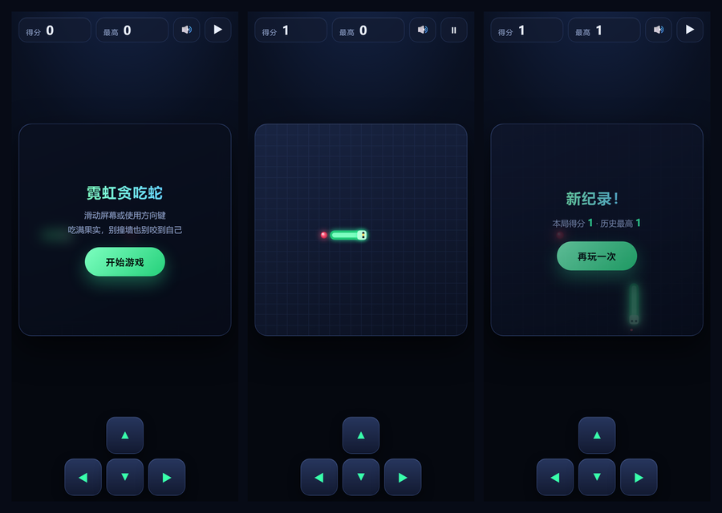

# 🐍 霓虹贪吃蛇

一个**手机优先**的网页版贪吃蛇，纯原生 HTML / CSS / JavaScript 编写，**零依赖、零构建**，直接把仓库挂在 GitHub Pages 上就能当服务器玩。



**在线试玩：<https://qiuye-autumnnight.github.io/snake-game/>**

> 手机上打开上面这个链接即可开玩；在浏览器菜单里选「添加到主屏幕」，就会像小程序一样全屏启动，并且断网也能玩。

## 玩法

| 操作 | 说明 |
| --- | --- |
| 在棋盘上滑动 | 上 / 下 / 左 / 右转向（一次拖动可连续转向） |
| 屏幕下方方向键 | 适合单手握持时用拇指操作 |
| 键盘方向键 / `WASD` | 电脑上使用 |
| 空格 / `Enter` | 开始、重开一局 |
| `P` | 暂停 / 继续 |

吃到红色果实得 1 分，蛇会变长，并且每吃一个就略微加速。撞到墙壁或自己的身体即结束，最高分会自动保存在浏览器本地。

## 特性

- 📱 **手机优先**：自适应正方形棋盘，`safe-area` 适配刘海屏，禁用双击缩放与页面滚动
- 👆 **三种操作方式**：滑动手势、屏幕方向键、物理键盘
- ✨ **Canvas 渲染**：插值动画让蛇平滑移动，霓虹发光、粒子爆开、呼吸跳动的果实
- 🔊 **音效与震动**：Web Audio 合成音效（可一键静音），手机上吃果实会轻微震动
- 🏆 **最高分记录**：`localStorage` 本地保存，刷新不丢
- 📴 **离线可用**：Service Worker 缓存全部资源，装到主屏后断网也能玩
- ⏸ **自动暂停**：切到后台或窗口失焦时自动暂停，回来接着玩
- 🚫 **零依赖**：没有 npm、没有打包步骤，改完直接刷新

## 本地运行

因为用到了 Service Worker，请用 HTTP 方式打开，不要直接双击 `index.html`：

```bash
# 任选一种
python -m http.server 8000
npx serve .
```

然后访问 <http://localhost:8000>。

## 部署到 GitHub Pages

这个仓库本身就是部署产物，开启 Pages 即可：

1. 打开仓库的 **Settings → Pages**
2. **Source** 选 `Deploy from a branch`
3. **Branch** 选 `main`、目录选 `/ (root)`，保存
4. 等一两分钟，访问 `https://<你的用户名>.github.io/<仓库名>/`

仓库里的 `.nojekyll` 空文件用来跳过 Jekyll 处理，避免下划线开头的文件被忽略。

## 文件结构

```
.
├── index.html              # 页面结构
├── styles.css              # 样式与响应式布局
├── game.js                 # 游戏逻辑与 Canvas 渲染
├── sw.js                   # Service Worker（离线缓存）
├── manifest.webmanifest    # PWA 清单（添加到主屏幕）
├── icons/                  # 各尺寸图标
├── screenshot.png          # README 预览图
└── .nojekyll               # 跳过 Jekyll
```

## 实现要点

- **固定 20×20 网格**，格子边长由可用空间实时计算，画布按 `devicePixelRatio` 放大以保证高清屏不糊
- **插值渲染**：记录上一步的蛇身，按 `累加时间 / 步进间隔` 在前后两格之间线性插值，所以蛇是滑行而不是跳格
- **方向队列**：缓存最多 3 个转向指令，避免快速连按导致「原地掉头」自杀
- **可变步进**：初始 165 ms/格，每吃一个果实减少 4.5 ms，最快 78 ms/格
- **蛇尾可进入**：判定碰撞时排除最后一节，因为这一步它正好移开

## License

[MIT](./LICENSE)
